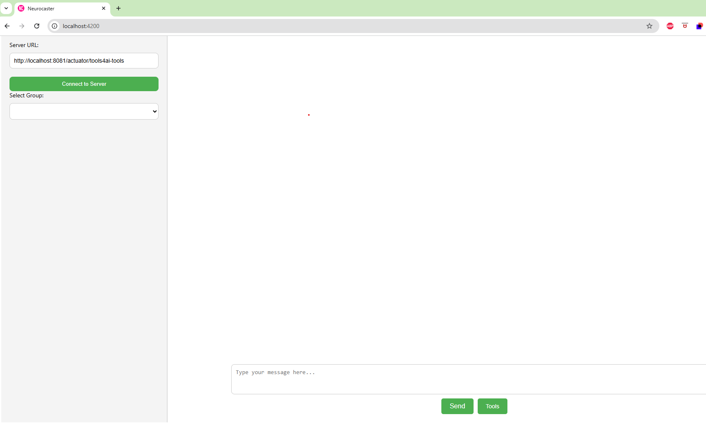
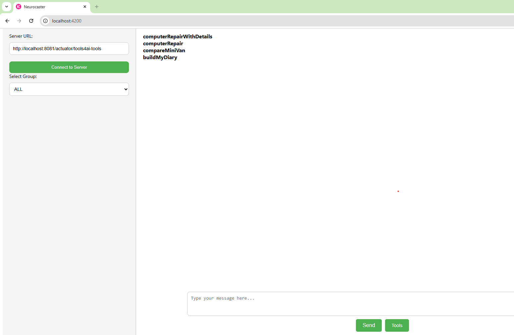
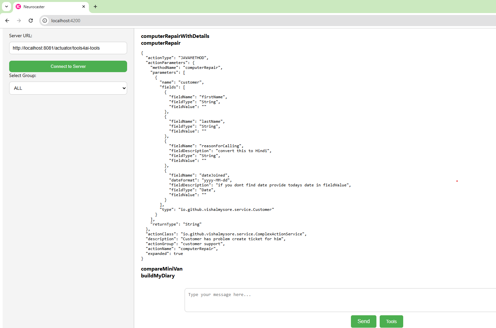
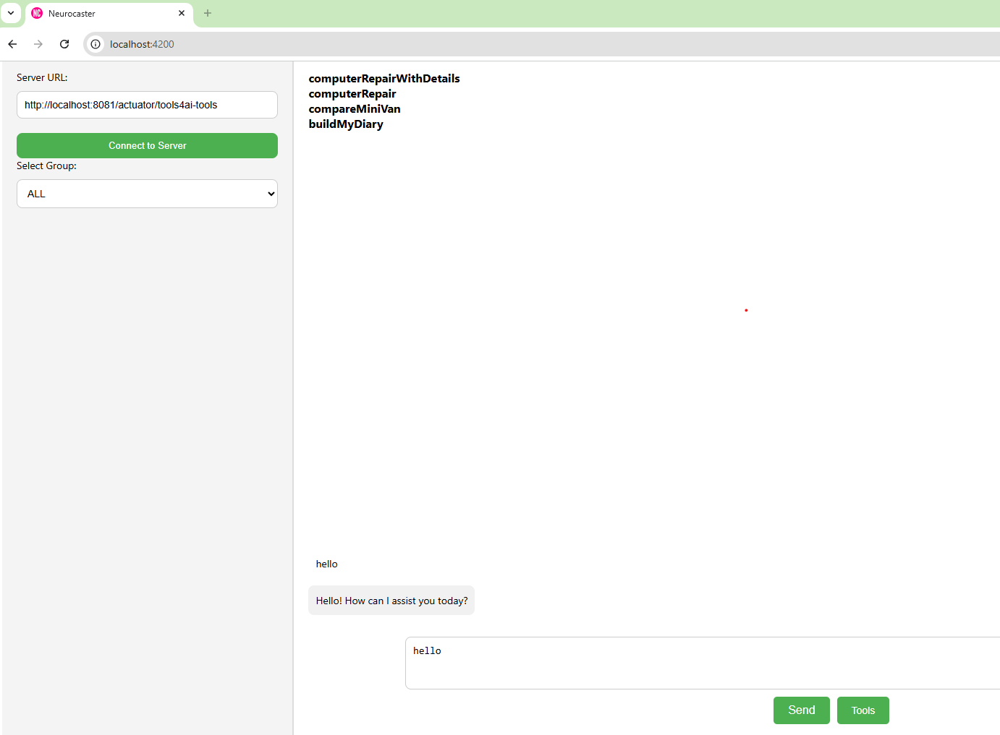
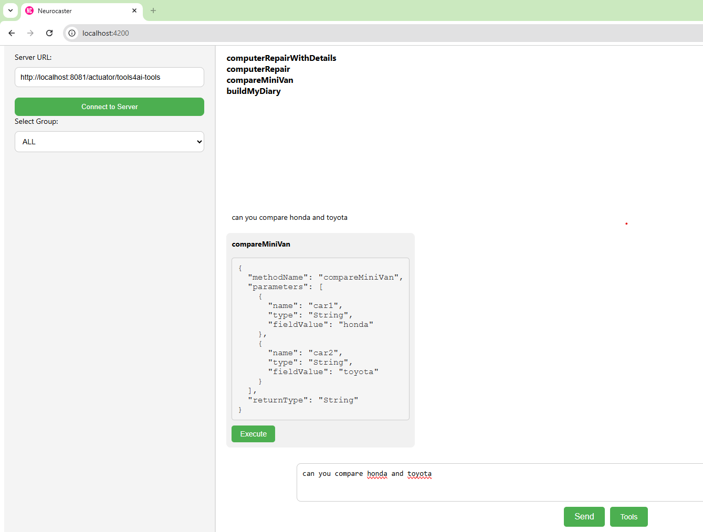
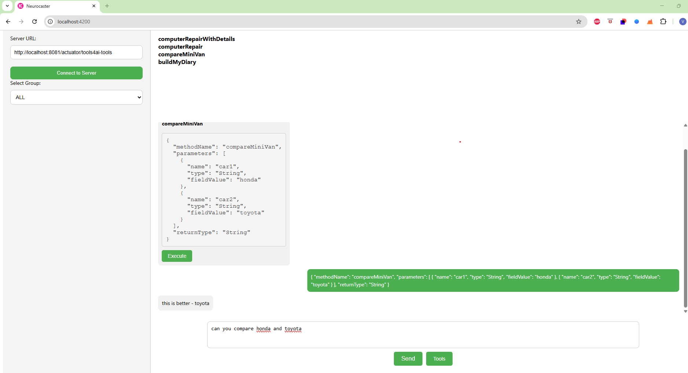

# 🧠 **Neurocaster-Client - Angular-based Client for Model Integration Protocol (MIP)**

**Neurocaster-Client** is an Angular-based application that interacts with **Model Integration Protocol (MIP)**, enabling users to **chat** with the system and **call tools** exposed via Spring Boot services. This client seamlessly integrates with MIP-powered services and facilitates dynamic interactions using WebSocket for real-time communication.

---

## 🚀 **Features**
- 💬 **Chat Functionality:** Engage in real-time chat with the system powered by MIP and Spring Boot services.
- 🔧 **Tool Invocation:** Call Spring Boot services annotated with `@Agent` and `@Action` directly through the client interface.
- ⚡ **Real-time Communication:** Uses WebSocket to handle chat and tool requests dynamically.

---

## ⚙️ **Setting Up Neurocaster-Client**

### 📥 **Installation Steps**

1. Clone the repository:
    ```bash
    git clone https://github.com/yourusername/neurocaster-client.git
    ```

2. Navigate to the project directory:
    ```bash
    cd neurocaster-client
    ```

3. Install the required dependencies:
    ```bash
    npm install
    ```

---

### 🧠 **Running the Client**

To run the Angular client, execute the following command:

```bash
ng serve
```

This will start the Angular development server. You can access the client at: http://localhost:4200

💬 Chat with the System
Once the client is running, you can initiate a chat with the system. Simply type your query in the chat interface, and the LLM will respond based on the available services exposed via MIP.

🔧 Call Tools
The client allows you to invoke tools exposed by the Neurocaster backend. For example, if you have a service like @Action(description = "Customer repair service"), you can call it directly from the client interface.

Type in your query for the tool, such as:

```  "Create a repair ticket for John Doe's laptop"
```
The client will automatically map the request to the appropriate tool method based on the MIP-enabled backend.


### Screenshots













